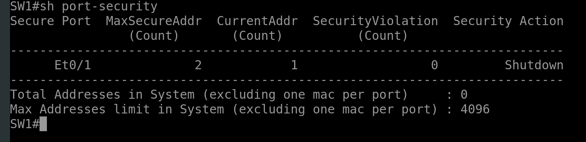

# Device Hardening

## Securing Unused Ports
``` bash
int range GigabitEthernet0/1-2
  shutdown
  exit

##moving unused ports to dedicated vlan
int range GigabitEthernet0/1-2
  switchport mode access 
  switchport access vlan 999
  shutdown
  exit
vlan 999
  name Parking_vlan
  shutdown
  exit

```

## Infrastructure ACL - iACLs
``` bash
ip access-list extended SSH_allowed
  permit 192.168.10.0 0.0.0.255 any eq 22
  deny tcp any any eq 22
  permit ip any any
  exit

```

## Disabling Unused Services
``` bash
##to display tcp/udp services the router is listening on
show control-plane host open-ports
##turn off http server
no ip http server
##turn off cdp service globally
no cdp run
##disable icmp redirect messages
no ip redirects


```


## Port Security
``` bash
##mac address filtering

#protect - offending frame is dropped

#restrict - offending frame is dropped, snmp trap and syslog message generated.
violation counter increments

#shutdown - offending frame is dropped, snmp trap and syslog message generated.
violation counter increments.
interface goes into error-disabled state

show port-security


```


``` bash

switchport mode access
switchport port-security mac-address aabb.cc00.0200
switchport port-security


```

## Port Security
``` bash
sticky
switchport port-security maximum 2
switchport port-security sticky
switchport port-security
```



## disabled port auto recovery (auto re-enable a port after a specified time)
``` bash

errdisable recovery cause p-secure violation
errdisable recovery interval 30


```

## Port Security with Dynamic Learning and Protect Violation

``` bash

test
```


## Implementing DHCP snooping
``` bash

```

